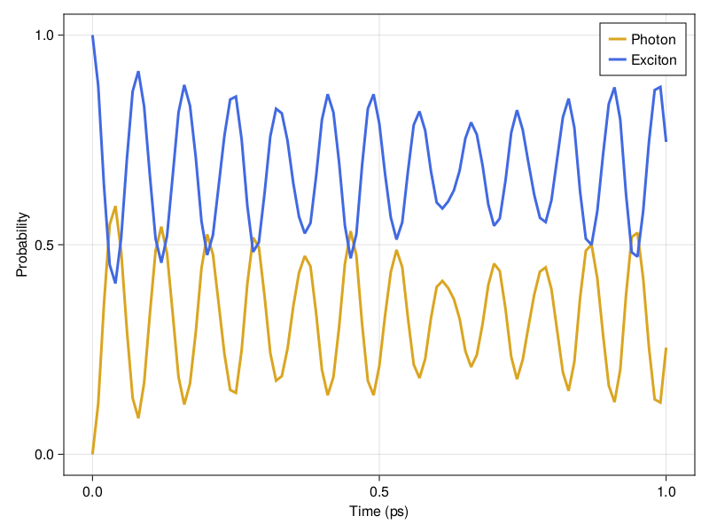

# PolaritonicSystems.jl

This is a prototype code used in our [research group](https://ribeiro.emorychem.science/) to study Polaritonic Wires. 

## Installation

This package is written in [julia](https://julialang.org/), so make sure you have an it installed and knows how to use its REPL and package manager. 

First, retrieve our code using Git
```
$ git clone git@github.com:RibeiroGroup/PolaritonicSystems.jl.git
```
Next, to use our code you need properly activate its enviroment. If you simply need to run a script where `PolaritonicSystems.jl` is used you can 
```
$ julia --project=PATH_TO/PolaritonicSystems.jl --threads 4 input.jl
```
where `PATH_TO` refers to the path where you copied this repository, `input.jl` is the script where `PolaritonicSystems.jl` is used, and `threads 4` sets the number of threads that julia will use. Note that is not necessary if you have `JULIA_NUM_THREADS` exported.


If you want to use `PolaritonicSystems.jl` within the julia REPL, you can start the terminal using
```
$ julia --project=PATH_TO/PolaritonicSystems.jl
```
Alternatively, you can use the pkg manager to activate the `PolaritonicSystems.jl` environment 
```
$ julia    # Open the julia REPL normally
julia> ] # Open the pkg manager
pkg> activate PATH_TO/PolaritonicSystems.jl/
```
Then you're ready to go!

## Usage

The main functionally of this code is to provide a system object. Specifically, the `QuantumWire` object can be constructed to hold all relevant information about the system. It constructs and diagonalizes a Hamiltonian (Coulomb gauge and Rotation Wave Approximation in the one exciton manifold) and also holds the information of the uncoupled states. That is, molecular energies, positions, photonic energies, wave vectors, etc.

A `QuantumWire` object is constructed as follows
```
julia> using PolaritonicSystems

julia> sys = QuantumWire(
    ΩR = 0.1eV,
    ϵ  = 3.0,
    Nc = 100,
    Nm = 1000,
    a  = 10nm,
    σa = 0,
    ωM = 2.0eV,
    σM = 0,
    Ly = 200nm,
    Lz = 400nm,
    nz = 1,
    ny = 1
)
```

where the arguments are 

| Argument  |   Type   |                                       Description                                                 |
|:---------:|:---------|:--------------------------------------------------------------------------------------------------| 
| ΩR        | Quantity | Rabi frequency: ΩR = μ₀√(ħω₀ρ/2ϵ).                                                                |
| ϵ         | Number   | Index of refraction squared: ϵ = n^2.                                                             |
| Nc        | Int      | Number of positive cavity modes. The total number of cavity modes is Ntotal = 2Nc + 1.            |
| Nm        | Int      | Number of molecules in the wire.                                                                  |
| a         | Quantity | Average distance between molecules.                                                               |
| σa        | Number   | Standard deviation w.r.t to the regular positions. Units assumed to match `a`.                    |
| ωM        | Quantity | Average molecular excitation energy. Supports frequency, wavenumber as well as true energy values.|
| σM        | Number   | Standard deviation for molecular excitation energies. Units assumed to match `ωM`.                |
| Ly        | Quantity | Cavity/wire length along Y direction. (Mirror).                                                   |
| Lz        | Quantity | Cavity/wire length along Z direction. (Mirror).                                                   |
| nz        | Int      | Radiation quantum number associated with Z coordinate.                                            |
| ny        | Int      | Radiation quantum number associated with Y coordinate.                                            |

Note that units here are handled by the package [`Unitful.jl`](https://github.com/PainterQubits/Unitful.jl). The default units used within the code are eV and nm.

Details on the role of each parameters can found in the Theory section of [this publication](https://arxiv.org/abs/2304.11453).

Once the `QuantumWire` object is constructed, you will have access to the following field:


| Field/Attribute  |   Type   |                                            Description                                                             |
|:----------------:|:---------|:-------------------------------------------------------------------------------------------------------------------| 
| Uix              | Matrix   | Transformation matrix from the uncoupled photon-molecule states to the polariton basis (eigenvector matrix of H).  |
| evals            | Vector   | Vector containing the eigenvalues of the system.                                                                   |
| phot_range       | Range    | Range of pure photonic states in the uncoupled basis.                                                              | 
| mol_range        | Range    | Range of pure molecular states in the uncoupled basis.                                                             | 
| mol_energies     | Vector   | Vector containing molecular excitation energies.                                                                   |
| mol_positions    | Vector   | Vector containing molecular positions along the wire.                                                              |
| phot_energies    | Vector   | Vector containing energies for the cavity/wire radiation modes.                                                    |

This information can also be retrieved using the help function within the julia REPL

```
julia> ? # access the help mode
help?> QuantumWire
```

Once your system is created, you will need to create quantum states on it. We have one auxiliary function that can help you creating excitons as Gaussian wave packets

```
μ  = 5000.0 # Center of the exciton in nm
σx = 360    # Standard deviation of the gaussian wave packet 
wvp = create_exciton_wavepacket(μ, σx, sys)
```
Since our `sys` object was created using 1000 molecules and 100 positive cavity modes (i.e. 201 total cavity modes), the length of `wvp` will be $N_M + 2N_c+1 = 1201$
```
length(wvp) == 1201
true
```
The array `wvp` contains complex values representing the amplitude of each energy **eigenstate** contributing to this quantum state. Let us use the package [`UnicodePlots.jl`](https://github.com/JuliaPlots/UnicodePlots.jl) to get a quick look into this quantum state.

```
julia> using UnicodePlots

julia> prob = abs2.(wvp) # We take the absolute square values to get probability
julia> scatterplot(prob)
       ┌────────────────────────────────────────┐ 
   0.2 │⠀⠀⠀⠀⠀⠀⠀⠀⠀⠀⠀⠀⠀⠀⠀⠀⠀⠀⠀⠀⠀⠀⠀⠀⠀⠀⠀⠀⠀⠀⠀⠀⠀│ 
       │⠀⠀⠀⠀⠀⠀⠀⠀⠀⠀⠀⠀⠀⠀⠀⠀⠀⠀⠀⠀⠀⠀⠀⠀⠀⠀⠀⠀⠀⠀⠀⠀⠀│ 
       │⠄⠀⠀⠀⠀⠀⠀⠀⠀⠀⠀⠀⠀⠀⠀⠀⠀⠀⠀⠀⠀⠀⠀⠀⠀⠀⠀⠀⠀⠀⠀⠀⠀│ 
       │⠀⠀⠀⠀⠀⠀⠀⠀⠀⠀⠀⠀⠀⠀⠀⠀⠀⠀⠀⠀⠁⠀⠀⠀⠀⠀⠀⠀⠀⠀⠀⠀⠀│ 
       │⠀⠀⠀⠀⠀⠀⠀⠀⠀⠀⠀⠀⠀⠀⠀⠀⠀⠀⠀⠀⠀⠀⠀⠀⠀⠀⠀⠀⠀⠀⠀⠀⠀│ 
       │⠀⠀⠀⠀⠀⠀⠀⠀⠀⠀⠀⠀⠀⠀⠀⠀⠀⠀⠀⠀⠀⠀⠀⠀⠀⠀⠀⠀⠀⠀⠀⠀⠀│ 
       │⠀⠀⠀⠀⠀⠀⠀⠀⠀⠀⠀⠀⠀⠀⠀⠀⠀⠀⠀⠀⠀⠀⠀⠀⠀⠀⠀⠀⠀⠀⠀⠀⠀│ 
       │⡀⠀⠀⠀⠀⠀⠀⠀⠀⠀⠀⠀⠀⠀⠀⠀⠀⠀⠀⠀⠀⠀⠀⠀⠀⠀⠀⠀⠀⠀⠀⠀⠀│ 
       │⠁⠀⠀⠀⠀⠀⠀⠀⠀⠀⠀⠀⠀⠀⠀⠀⠀⠀⠀⠀⠂⠀⠀⠀⠀⠀⠀⠀⠀⠀⠀⠀⠀│ 
       │⠀⠀⠀⠀⠀⠀⠀⠀⠀⠀⠀⠀⠀⠀⠀⠀⠀⠀⠀⠀⡀⠀⠀⠀⠀⠀⠀⠀⠀⠀⠀⠀⠀│ 
       │⠁⠀⠀⠀⠀⠀⠀⠀⠀⠀⠀⠀⠀⠀⠀⠀⠀⠀⠀⠀⠂⠀⠀⠀⠀⠀⠀⠀⠀⠀⠀⠀⠀│ 
       │⡀⠀⠀⠀⠀⠀⠀⠀⠀⠀⠀⠀⠀⠀⠀⠀⠀⠀⠀⠀⠄⠀⠀⠀⠀⠀⠀⠀⠀⠀⠀⠀⠀│ 
       │⠄⠀⠀⠀⠀⠀⠀⠀⠀⠀⠀⠀⠀⠀⠀⠀⠀⠀⠀⠀⠀⠀⠀⠀⠀⠀⠀⠀⠀⠀⠀⠀⠀│ 
       │⡄⠀⠀⠀⠀⠀⠀⠀⠀⠀⠀⠀⠀⠀⠀⠀⠀⠀⠀⠀⠂⠀⠀⠀⠀⠀⠀⠀⠀⠀⠀⠀⠀│ 
     0 │⣄⣀⣀⣀⣀⣀⣀⣀⣀⣀⣀⣀⣀⣀⣀⣀⣀⣀⣀⣀⣆⣀⣀⣀⡀⠀⠀⠀⠀⠀⠀⠀⠀│ 
       └────────────────────────────────────────┘ 
       ⠀0⠀⠀⠀⠀⠀⠀⠀⠀⠀⠀⠀⠀⠀⠀⠀⠀⠀⠀⠀⠀⠀⠀⠀⠀⠀⠀⠀⠀⠀⠀⠀⠀⠀⠀2 000⠀
```
This may not look quite right, but remember the basis here are the energy eigenstates! So this plot basically tell us that there are two energy eigenstates contributing most significantly to this state. It makes more sense if we plot it against the system energies, we can retrieve that from the fields of `sys`.

```
julia> scatterplot(sys.evals, prob)
       ┌────────────────────────────────────────┐ 
   0.2 │⠀⠀⠀⠀⠀⠀⠀⠀⠀⠀⠀⠀⠀⠀⠀⠀⠀⠀⠀⠀⠀⠀⠀⠀⠀⠀⠀⠀⠀⠀⠀⠀⠀│ 
       │⠀⠀⠀⠀⠀⠀⠀⠀⠀⠀⠀⠀⠀⠀⠀⠀⠀⠀⠀⠀⠀⠀⠀⠀⠀⠀⠀⠀⠀⠀⠀⠀⠀│ 
       │⠀⠀⠀⠀⠀⠄⠀⠀⠀⠀⠀⠀⠀⠀⠀⠀⠀⠀⠀⠀⠀⠀⠀⠀⠀⠀⠀⠀⠀⠀⠀⠀⠀│ 
       │⠀⠀⠀⠀⠀⠀⠁⠀⠀⠀⠀⠀⠀⠀⠀⠀⠀⠀⠀⠀⠀⠀⠀⠀⠀⠀⠀⠀⠀⠀⠀⠀⠀│ 
       │⠀⠀⠀⠀⠀⠀⠀⠀⠀⠀⠀⠀⠀⠀⠀⠀⠀⠀⠀⠀⠀⠀⠀⠀⠀⠀⠀⠀⠀⠀⠀⠀⠀│ 
       │⠀⠀⠀⠀⠀⠀⠀⠀⠀⠀⠀⠀⠀⠀⠀⠀⠀⠀⠀⠀⠀⠀⠀⠀⠀⠀⠀⠀⠀⠀⠀⠀⠀│ 
       │⠀⠀⠀⠀⠀⠀⠀⠀⠀⠀⠀⠀⠀⠀⠀⠀⠀⠀⠀⠀⠀⠀⠀⠀⠀⠀⠀⠀⠀⠀⠀⠀⠀│ 
       │⠀⠀⠀⠀⠀⡀⠀⠀⠀⠀⠀⠀⠀⠀⠀⠀⠀⠀⠀⠀⠀⠀⠀⠀⠀⠀⠀⠀⠀⠀⠀⠀⠀│ 
       │⠀⠀⠀⠀⠀⠁⠂⠀⠀⠀⠀⠀⠀⠀⠀⠀⠀⠀⠀⠀⠀⠀⠀⠀⠀⠀⠀⠀⠀⠀⠀⠀⠀│ 
       │⠀⠀⠀⠀⠀⠀⡀⠀⠀⠀⠀⠀⠀⠀⠀⠀⠀⠀⠀⠀⠀⠀⠀⠀⠀⠀⠀⠀⠀⠀⠀⠀⠀│ 
       │⠀⠀⠀⠀⠀⠁⠂⠀⠀⠀⠀⠀⠀⠀⠀⠀⠀⠀⠀⠀⠀⠀⠀⠀⠀⠀⠀⠀⠀⠀⠀⠀⠀│ 
       │⠀⠀⠀⠀⠀⡀⠄⠀⠀⠀⠀⠀⠀⠀⠀⠀⠀⠀⠀⠀⠀⠀⠀⠀⠀⠀⠀⠀⠀⠀⠀⠀⠀│ 
       │⠀⠀⠀⠀⠀⠄⠀⠀⠀⠀⠀⠀⠀⠀⠀⠀⠀⠀⠀⠀⠀⠀⠀⠀⠀⠀⠀⠀⠀⠀⠀⠀⠀│ 
       │⠀⠀⠀⠀⠀⡠⠂⠀⠀⠀⠀⠀⠀⠀⠀⠀⠀⠀⠀⠀⠀⠀⠀⠀⠀⠀⠀⠀⠀⠀⠀⠀⠀│ 
     0 │⠀⠀⠀⠀⠀⣠⣆⣀⣀⣀⣀⣀⣀⣀⣀⣀⣀⣀⣀⣀⣀⣀⣀⣀⣀⣀⣀⣀⣀⣀⣀⣀⣀│ 
       └────────────────────────────────────────┘ 
       ⠀1⠀⠀⠀⠀⠀⠀⠀⠀⠀⠀⠀⠀⠀⠀⠀⠀⠀⠀⠀⠀⠀⠀⠀⠀⠀⠀⠀⠀⠀⠀⠀⠀⠀⠀⠀⠀⠀⠀8⠀
```
Now we see that the wave packet is pretty well localized around 2 eV! But what about its spatial distribution? We will need to perform a change of basis from the eigenbasis (coupled) to the local (uncoupled). This is done using the eigenvectors of the Hamiltonian matrix, conveniently stored in `sys` as `Uix`. This matrix maps the eigenbasis $|\chi\rangle$ to the local basis $|i\rangle$ as

$$ |i\rangle = \sum_\chi U_{i\chi} |\chi\rangle $$

Hence, we can plot the spatial distribution of our wave packet using the following steps:

1. Convert the wave packet to the local basis
```
loc = sys.Uix * wvp
```
2. Since we only care about the molecular part of the wave packet, we can slice `loc` using `sys.mol_range` to select only molecular states and then compute probabilities
```
prob = abs2.(loc[sys.mol_range])
```
3. Finally, we can plot the wave packet against the molecular positions (stored in `sys.mol_positions`)
```
julia> scatterplot(sys.mol_positions, prob)
        ┌─────────────────────────────────────────────────┐ 
   0.02 │⠀⠀⠀⠀⠀⠀⠀⠀⠀⠀⠀⠀⠀⠀⠀⠀⠀⠀⠀⠀⠀⠀⠀⠀⠀⠀⠀⠀⠀⠀⠀⠀⠀⠀⠀⠀⠀⠀⠀⠀│ 
        │⠀⠀⠀⠀⠀⠀⠀⠀⠀⠀⠀⠀⠀⠀⠀⠀⠀⠀⠀⠀⠀⠀⠀⠀⠀⠀⠀⠀⠀⠀⠀⠀⠀⠀⠀⠀⠀⠀⠀⠀│ 
        │⠀⠀⠀⠀⠀⠀⠀⠀⠀⠀⠀⠀⠀⠀⠀⠀⠀⠀⠀⠀⠀⠀⠀⠀⠀⠀⠀⠀⠀⠀⠀⠀⠀⠀⠀⠀⠀⠀⠀⠀│ 
        │⠀⠀⠀⠀⠀⠀⠀⠀⠀⠀⠀⠀⠀⠀⠀⠀⠀⠀⠀⠀⠀⠀⠀⠀⠀⠀⠀⠀⠀⠀⠀⠀⠀⠀⠀⠀⠀⠀⠀⠀│ 
        │⠀⠀⠀⠀⠀⠀⠀⠀⠀⠀⠀⠀⠀⠀⠀⠀⠀⠀⠀⠀⠀⠀⠀⠀⠀⠀⠀⠀⠀⠀⠀⠀⠀⠀⠀⠀⠀⠀⠀⠀│ 
        │⠀⠀⠀⠀⠀⠀⠀⠀⠀⠀⠀⠀⠀⠀⠀⠀⠀⠀⠀⠀⠀⠀⠀⠀⠀⠀⠀⠀⠀⠀⠀⠀⠀⠀⠀⠀⠀⠀⠀⠀│ 
        │⠀⠀⠀⠀⠀⠀⠀⠀⠀⠀⠀⠀⠀⠀⠀⠀⠀⠀⠀⢠⡄⠀⠀⠀⠀⠀⠀⠀⠀⠀⠀⠀⠀⠀⠀⠀⠀⠀⠀⠀│ 
        │⠀⠀⠀⠀⠀⠀⠀⠀⠀⠀⠀⠀⠀⠀⠀⠀⠀⠀⠀⡏⢹⠀⠀⠀⠀⠀⠀⠀⠀⠀⠀⠀⠀⠀⠀⠀⠀⠀⠀⠀│ 
        │⠀⠀⠀⠀⠀⠀⠀⠀⠀⠀⠀⠀⠀⠀⠀⠀⠀⠀⢠⠃⠘⡆⠀⠀⠀⠀⠀⠀⠀⠀⠀⠀⠀⠀⠀⠀⠀⠀⠀⠀│ 
        │⠀⠀⠀⠀⠀⠀⠀⠀⠀⠀⠀⠀⠀⠀⠀⠀⠀⠀⢸⠀⠀⡇⠀⠀⠀⠀⠀⠀⠀⠀⠀⠀⠀⠀⠀⠀⠀⠀⠀⠀│ 
        │⠀⠀⠀⠀⠀⠀⠀⠀⠀⠀⠀⠀⠀⠀⠀⠀⠀⠀⡏⠀⠀⢹⠀⠀⠀⠀⠀⠀⠀⠀⠀⠀⠀⠀⠀⠀⠀⠀⠀⠀│ 
        │⠀⠀⠀⠀⠀⠀⠀⠀⠀⠀⠀⠀⠀⠀⠀⠀⠀⢀⡇⠀⠀⠸⡀⠀⠀⠀⠀⠀⠀⠀⠀⠀⠀⠀⠀⠀⠀⠀⠀⠀│ 
        │⠀⠀⠀⠀⠀⠀⠀⠀⠀⠀⠀⠀⠀⠀⠀⠀⠀⢸⠀⠀⠀⠀⡇⠀⠀⠀⠀⠀⠀⠀⠀⠀⠀⠀⠀⠀⠀⠀⠀⠀│ 
        │⠀⠀⠀⠀⠀⠀⠀⠀⠀⠀⠀⠀⠀⠀⠀⠀⠀⡏⠀⠀⠀⠀⢹⠀⠀⠀⠀⠀⠀⠀⠀⠀⠀⠀⠀⠀⠀⠀⠀⠀│ 
      0 │⣀⣀⣀⣀⣀⣀⣀⣀⣀⣀⣀⣀⣀⣀⣀⣀⡼⠁⠀⠀⠀⠀⠀⢧⣀⣀⣀⣀⣀⣀⣀⣀⣀⣀⣀⣀⣀⣀⣀⣀│ 
        └─────────────────────────────────────────────────┘ 
        ⠀0⠀⠀⠀⠀⠀⠀⠀⠀⠀⠀⠀⠀⠀⠀⠀⠀⠀⠀⠀⠀⠀⠀⠀⠀⠀⠀⠀⠀⠀⠀⠀⠀⠀10 000⠀ 
```

## Example

Here is a slightly more elaborate example, where we use the plotting library [`Makie.jl`](https://docs.makie.org/stable/) to time-evolve the exciton wave packet keeping track of the probability of finding a photon in the system. 

```
using PolaritonicSystems
using MKL       # Fast matrix operations

# Plotting libraries
using Makie
using CairoMakie

# System inputs
sys = QuantumWire(
    ΩR = 0.05eV,
    ϵ  = 3.0,
    Nc = 100,
    Nm = 1000,
    a  = 10nm,
    σa = 0,
    ωM = 2.0eV,
    σM = 0,
    Ly = 200nm,
    Lz = 400nm,
    nz = 1,
    ny = 1,
)

# Initial state inputs
wvp = create_exciton_wavepacket(5000.0, 120, sys)
# Time inverval in picoseconds
tvals = 0:0.01:1
# Preallocate array for photonic probabilities
pvals = zeros(length(tvals))

for i in eachindex(tvals)
    t = tvals[i]

    # Get the time-evolved wave packet
    new = time_propagate(wvp, sys, t)
    # Convert to local basis
    loc = sys.Uix * new
    # Compute probability for each photon mode
    prob = abs2.(loc[sys.phot_range])

    pvals[i] = sum(prob)
end

# Plotting commands. See Makie documentation for more details. 
fig = Figure()
ax = Axis(fig[1,1], xlabel="Time (ps)", ylabel="Probability")
lines!(ax, tvals, pvals, color=:goldenrod, label="Photon", linewidth=3)
lines!(ax, tvals, 1 .- pvals, color=:royalblue, label="Exciton", linewidth=3)
axislegend(ax)
save("example.png", fig)
```

The result is



